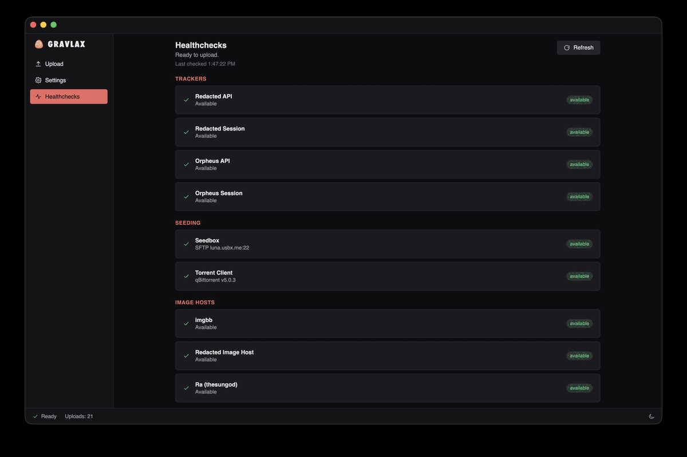

# Gravlax

Gravlax prepares music releases for RED/OPS. It guides each
release through file checks, spectrals, metadata, tags, transcodes, upload, and
seeding.



## Quick start

1. Download and open Gravlax from the [latest release](https://github.com/gravlax7/gravlax/releases).
2. Install the required command-line tools listed below. Put them on your `PATH`,
   or set their paths in **Settings → Tools**.
3. Open **Settings** and set up your folders, a tracker, and an image host. Then
   open **Healthcheck** and fix any items marked missing or failing.
4. Choose a release folder from the start screen and work through the seven
   steps.

## Supported services

| Type | Supported services |
| --- | --- |
| Image hosts | Ra (thesungod), ImgBB, catbox, and the Redacted image host |
| Metadata providers | MusicBrainz, Deezer, Bandcamp |
| Torrent clients | qBittorrent |

Only ImgBB & Catbox can be used for spectral uploads.

Don't be afraid to request support for more image hosts, metadata providers, or torrent clients.

## Import settings from smoked-salmon

If you use smoked-salmon, open **Settings → Import**, choose its `config.toml`,
review the suggested changes, select the ones you want, and save the settings.
The usual config locations are:

- macOS: `~/Library/Application Support/smoked-salmon/config.toml`
- Linux: `~/.config/smoked-salmon/config.toml`

It can also read `rclone.conf` when your smoked-salmon seedbox uses rclone. The
importer shows every change before it applies it, so you can keep or skip each
setting.

## Required external tools

Install these tools and make sure Gravlax can find them:

| Tool | Supported version | Used for |
| --- | --- | --- |
| SoX | SoX 14.4.2 or a current SoX_ng release | Spectrals and FLAC downconversion |
| FLAC tools (`flac` and `metaflac`, installed together) | 1.5.0 or newer | FLAC checks, decoding, and tags |
| LAME | 3.100 or newer | MP3 encoding |

Gravlax requires FLAC 1.5.0 because its safe tag and cover-art workflow uses
`metaflac` features added in that release. FLAC 1.3.1 is not supported. Other
older SoX and LAME releases may work, but they are not part of the supported
set.

Leave a tool path blank in **Settings → Tools** to let Gravlax search your
`PATH` and common install locations. Healthcheck shows the executable path and
version it found. If a tool is too old, update it or select a newer executable
in **Settings → Tools**.

### Windows

[Scoop](https://scoop.sh) is recommended for installing command-line tools on
Windows. Open a regular PowerShell window and run:

```powershell
Set-ExecutionPolicy -ExecutionPolicy RemoteSigned -Scope CurrentUser
Invoke-RestMethod -Uri https://get.scoop.sh | Invoke-Expression
scoop install sox flac lame
```

Restart Gravlax after installing the tools. If it cannot find a tool, check
that its install folder is on `PATH`, or set the tool path in **Settings →
Tools**.

### macOS

[Homebrew](https://brew.sh) is recommended for installing the required tools. If
Homebrew is not installed, open Terminal and run its installer:

```sh
/bin/bash -c "$(curl -fsSL https://raw.githubusercontent.com/Homebrew/install/HEAD/install.sh)"
```

Then install the tools:

```sh
brew install sox flac lame
```

You might need to restart Gravlax. If needed, set the tool paths in **Settings → Tools**.

### Linux

On Debian or Ubuntu, install the tools with:

```sh
sudo apt update
sudo apt install sox libsox-fmt-all flac lame
```

On Arch Linux, use:

```sh
sudo pacman -S sox flac lame
```

Some older Linux releases package FLAC 1.4 or earlier. Run `flac --version`
after installation. If it reports a version below 1.5.0, install a current
package from your distribution or from the [FLAC project](https://xiph.org/flac/download.html).

## Important settings

- **Directories:** Set **Source** to the folder that holds releases before you
  upload them. Set **Torrents** if you want to keep created torrent files, and
  **Seeding** when you seed with a local client.
- **Trackers:**   Tracker URLs are not included in the application's code, you need to find them yourself and enter them in settings.
  Enable each tracker you use and enter an API key and session cookie. Both are required for Gravlax to work properly.
- **Image Hosts:** Enable an image host and add its API key where needed. Pick
  the host for spectrals and each tracker.
  Redacted IH and Ra cannot be used for spectrals upload.
- **Torrent Client:** Set this up if you seed through qBittorrent's Web UI.
- **Seedbox:** Turn this on only when you want Gravlax to send release folders
  over SFTP before it adds the torrent.
- **Metadata Providers:** MusicBrainz is on by default. You can also enable
  Deezer.

Use **Healthcheck** after any change. Gravlax is ready when it reports that the
required tools, at least one image host, and every enabled tracker are available.

## Development

This repo targets Node.js 24 for local tools and CI. Bun runs the project
scripts, so install Bun as well.

```bash
bun install
bun run dev
```

### Test

```bash
bun test
bun run typecheck
```

### Package

```bash
bun run dist       # all configured targets
bun run dist:mac
bun run dist:linux
bun run dist:win
```
